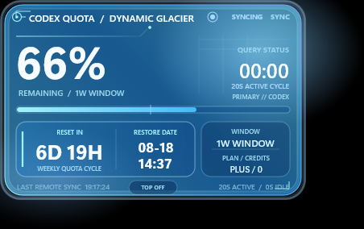

# Rainmeter Codex 额度监视器

[English](README.md)



一个非官方、任务感知的 Rainmeter 桌面面板，用于显示本机 Codex 应用返回的额度信息。

## 功能

- Codex 任务开始时立即刷新，任务进行期间每 20 秒刷新一次。
- 任务完成后最终刷新一次，随后进入无远程轮询、无动画的 `SILENT` 状态。
- 在底部将 `QUIET / RESUME` 与 `TOP OFF / TOP ON` 并排，可在任务期间暂停查询与呼吸效果。
- 显示剩余额度、重置倒计时、恢复日期与时间、套餐和下次查询倒计时。
- 仅在任务活动或同步期间启用整圈呼吸与扫描效果。
- 内置持久化的 `TOP OFF / TOP ON` 窗口层级开关。
- 提供 Glacier、Aurora 和 Blueprint 三种视觉方案。
- 可在 `Variables.inc` 中继续调整颜色、字体、透明度和刷新周期。

## 环境要求

- Windows 10 或 Windows 11
- Rainmeter 4.5 或更高版本
- 本机已安装并登录 Codex 应用或 CLI
- 从源码构建原生监听器时需要 Windows .NET Framework 4.x 编译器

## 安装

1. 从最新 GitHub Release 下载 `CodexQuotaOptions_1.5.0.rmskin`。
2. 使用 Rainmeter Skin Installer 打开安装包。
3. 如未自动加载，请加载 `CodexQuotaOptions\Glacier\Glacier.ini`。

Glacier 默认使用普通窗口层级（`TOP OFF`），全屏游戏和其他应用可以覆盖面板。点击底部中央按钮可切换为 `TOP ON`。

## 工作方式

| 状态 | 远程刷新 | 动画 |
| --- | --- | --- |
| `TASK ACTIVE` | 立即刷新，随后每 20 秒一次 | 呼吸与扫描 |
| `QUIET` | 恢复或任务结束前不查询 | 完全静止，但继续监听任务状态 |
| `SYNCING` | 正在执行一次查询 | 加强呼吸 |
| `SILENT` | 不查询 | 完全静止 |
| 手动 `SYNC` | 单次查询 | 同步动画 |

轻量原生监听器只根据本地任务生命周期事件判断活动状态；任务进行时复用本机 `codex app-server`，回到 `SILENT` 后停止该辅助进程。

`QUIET` 只作用于当前任务活动阶段；点击 `RESUME` 会立即刷新并恢复 20 秒节奏。最后一个活动任务结束后，主动静默会自动清除，并按原逻辑执行最终快照。如果皮肤或监听器在该任务仍活动时重启，已经生效的静默状态会自动恢复，同时不会重复应用已经消费过的旧静默令牌。

## 隐私说明

- 读取 `%USERPROFILE%\.codex\sessions` 下的本地任务事件，以识别任务开始、完成或中止。
- 通过本机已安装的 Codex 进程读取额度。
- 不包含 API Key、账户 Token、分析代码或第三方遥测。
- 不会上传会话文件或额度信息。

提交问题时请勿附带个人会话文件或认证日志。

## 自定义

右键 Glacier 选择 **Edit dynamic panel settings**，或者编辑：

```text
Skins\CodexQuotaOptions\@Resources\Variables.inc
```

动态界面逻辑位于 `DynamicPanel.lua`；任务监听源码位于 `CodexQuotaAgent.cs` 和 `SessionEventScanner.cs`。

## 构建

在 Windows PowerShell 中运行：

```powershell
.\Build-Release.ps1 -Version 1.5.0
```

该命令会编译原生监听器、在 `dist` 中生成 `.rmskin`，并写入 `SHA256SUMS.txt`。生成的可执行文件和安装包不会提交到源码仓库。

## 免责声明

这是独立的社区项目，与 OpenAI 无隶属、认可或维护关系。Codex 商标归其权利人所有。项目依赖本机 Codex 的实现细节，未来版本可能发生兼容性变化。

## 许可证

[MIT](LICENSE)
